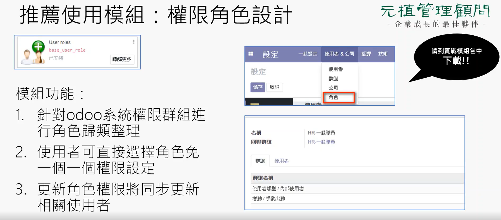
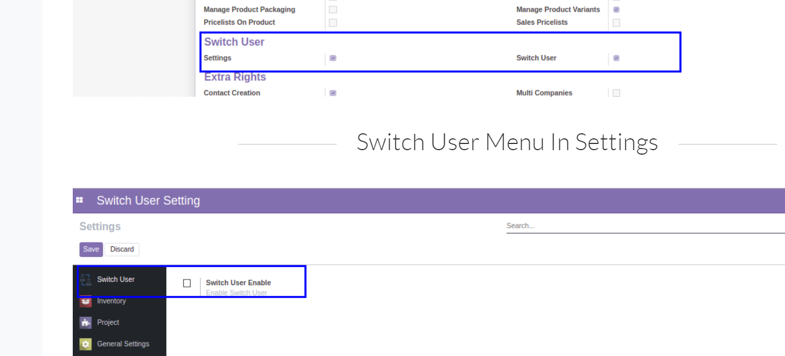
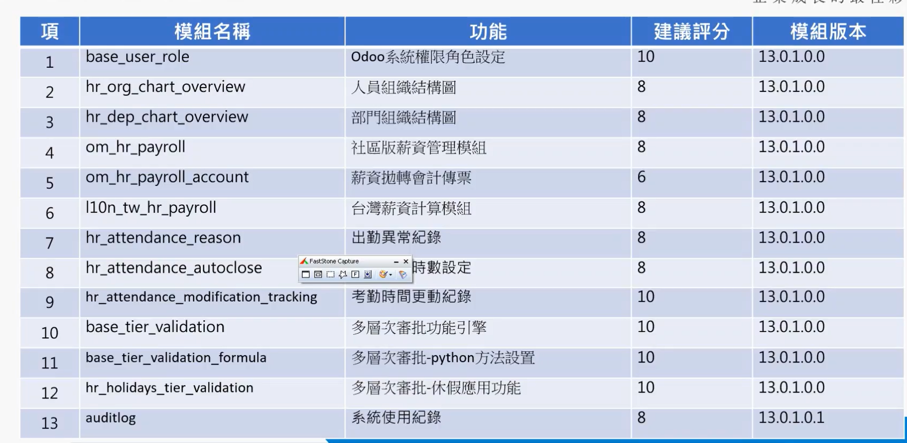

# odoo13_smobio
##原生模組安裝
###- 員工、費用、庫存、會計、銷售、採購、
##第三方模組安裝
- employee_expense_advance (預用預支模組)(odoo10升級)
- Base Tier Validation (基礎簽核模組)
- Base Tier Validation Formula (簽核可寫入程式)
- Base Tier Validation Forward (簽核轉發)
- Purchase Tier Validation - Forward Option (採購簽核轉發)
- Expense Tier Validation (費用簽核)
- Purchase Tier Validation (採購簽核)
- Purchase Request Tier Validation (採購請求簽核) 
- Sale Tier Validation (銷售簽核)
- base_user_role (系統權限角色設定)

- (oca)Account - Missing Menus (顯示財務設定選單)
- (oca)Account Financial Reports (財務報表)
- (oca)Advanced search (進階蒐尋可使用o2m的條件)
- (oca)Base report xlsx
- (oca)Date Range (財務報表中 日期的快速下拉)
- switch_user_app (切換使用者，配合簽核使用)

### 佈景
- Dependency for backend_theme_v13

